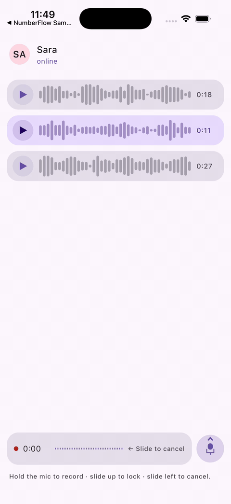

# VoiceMessage

**WhatsApp / Telegram-style voice messaging primitives for Compose Multiplatform.** A
hold-to-record mic with slide-to-lock and slide-to-cancel gestures, plus a playback bubble with
waveform and scrubber. One library, every CMP target — audio capture stays BYO.

[](https://central.sonatype.com/artifact/io.github.nadeemiqbal/voice-message)
[](LICENSE)
[](https://github.com/NadeemIqbal/voice-message/actions/workflows/build.yml)
[](https://kotlinlang.org)


<p align="center">
  
</p>

<!-- Animated iOS recording captured from sample/iosApp via `simctl recordVideo` + ffmpeg. -->

## Why this library

Every chat app eventually needs the WhatsApp / Telegram voice interaction — and every team
rebuilds it from scratch. The gesture choreography is the awkward part: long-press to start,
slide up past a threshold to lock, slide left past another threshold to cancel, release with
different outcomes per phase, plus the live amplitude waveform and the receive-side playback
bubble with seekable scrubber.

`voice-message` ships that whole flow as a clean Compose Multiplatform primitive. Audio capture
(microphone, encoding, file output) stays **BYO** so the library remains pure Compose and works
identically on every CMP target — you wire `MediaRecorder` / `AVAudioRecorder` / Web Audio /
JavaSound into the state callbacks once and the UX behaves the same everywhere.

## Platform support

| Platform | Supported | Tested              |
|----------|:---------:|---------------------|
| Android  |     ✅     | ✅ (unit + UI)       |
| iOS      |     ✅     | ✅ (UI, Skiko)       |
| Desktop  |     ✅     | ✅ (unit + UI)       |
| Web      |     ✅     | ✅ (compile + logic) |

## Installation

`gradle/libs.versions.toml`:

```toml
[libraries]
voice-message = { module = "io.github.nadeemiqbal:voice-message", version = "0.1.0" }
```

`commonMain` dependencies:

```kotlin
kotlin {
    sourceSets {
        commonMain.dependencies {
            implementation(libs.voice.message)
        }
    }
}
```

## Quick start — the recorder

```kotlin
val recorderState = rememberVoiceRecorderState(
    onStart = { /* open MediaRecorder / AVAudioRecorder / Web Audio worklet */ },
    onCancel = { /* close + delete the in-progress file */ },
    onSend = { duration, samples ->
        // close the recorder, encode, ship the file
        viewModel.sendVoiceMessage(file, duration, samples)
    },
)

// In your chat input row:
VoiceRecorderInput(
    state = recorderState,
    idlePlaceholder = {
        // your text field goes here — visible while not recording
        ChatTextField(modifier = Modifier.weight(1f))
    },
)

// Feed live amplitudes from your audio source while recording:
LaunchedEffect(Unit) {
    audioCapture.amplitudes.collect { recorderState.pushAmplitude(it) }
}
```

## Quick start — the playback bubble

```kotlin
VoiceMessageBubble(
    samples = message.amplitudes,          // List<Float> 0f..1f
    duration = message.duration,
    isPlaying = playerState.isPlaying(message.id),
    progress = playerState.progress(message.id),
    onPlayPauseToggle = { playerState.toggle(message.id) },
    onSeek = { fraction -> playerState.seek(message.id, fraction) },
    role = if (message.isMine) VoiceMessageRole.Sender else VoiceMessageRole.Receiver,
)
```

## API examples

**Programmatic control over the recorder**

```kotlin
recorderState.start()                                // begin recording
recorderState.pushAmplitude(0.6f)                    // feed mic peaks while recording
recorderState.forceCancel()                          // discard (e.g. on incoming call)
recorderState.sendFromLock()                         // tap the Send button while locked
recorderState.cancelFromLock()                       // tap Cancel while locked
recorderState.phase                                  // VoicePhase.Idle | RecordingHeld | ...
recorderState.elapsed                                // current Duration
recorderState.capturedSamples                        // List<Float> pushed so far
```

**Tuning thresholds**

```kotlin
VoiceRecorderInput(
    state = recorderState,
    lockThresholdDp = 100.dp,                        // longer slide-up to lock
    cancelThresholdDp = 60.dp,                       // shorter slide-left to cancel
)

rememberVoiceRecorderState(
    minDuration = 800.milliseconds,                  // tighter tap-vs-hold threshold
    maxDuration = 10.minutes,                        // longer recordings allowed
    onSend = { _, _ -> },
)
```

**Custom colours**

```kotlin
VoiceRecorderInput(
    state = recorderState,
    colors = VoiceMessageDefaults.recorderColors().copy(
        micActiveColor = Color(0xFF25D366),          // WhatsApp green
        sendButtonColor = Color(0xFF25D366),
    ),
)
```

## BYO audio — adapter recipes

The library never opens a microphone or writes a file. Wire your platform audio in three places:

### Android (`MediaRecorder`)

```kotlin
val recorder = MediaRecorder(context).apply {
    setAudioSource(MediaRecorder.AudioSource.MIC)
    setOutputFormat(MediaRecorder.OutputFormat.MPEG_4)
    setAudioEncoder(MediaRecorder.AudioEncoder.AAC)
    setOutputFile(file)
}
val state = rememberVoiceRecorderState(
    onStart = { recorder.prepare(); recorder.start() },
    onCancel = { recorder.stop(); recorder.release(); file.delete() },
    onSend = { duration, _ -> recorder.stop(); recorder.release(); upload(file, duration) },
)

// Poll the recorder for amplitude:
LaunchedEffect(state.phase) {
    while (state.phase == VoicePhase.RecordingHeld ||
           state.phase == VoicePhase.RecordingLocked ||
           state.phase == VoicePhase.Cancelling) {
        state.pushAmplitude(recorder.maxAmplitude / 32768f)
        delay(50)
    }
}
```

### iOS (`AVAudioRecorder` via expect/actual)

Sketch — see your favourite Kotlin/Native audio stack for the full glue. The point is that the
library's API is the same on every platform; only the actual audio plumbing differs.

### Web (Web Audio API), Desktop (JavaSound)

Same pattern — open the capture API on `onStart`, push amplitudes into `pushAmplitude`, close
on `onCancel` / `onSend`.

## The gesture state machine

```
       long-press
Idle ──────────────► RecordingHeld
                      │  │  │
                      │  │  └─ release (elapsed >= minDuration)
                      │  │        └► onSend(duration, samples)
                      │  │
                      │  ├─ slide-up past lockThreshold ► RecordingLocked
                      │  │      ├─ Send tapped ► onSend(…)
                      │  │      └─ Cancel tapped ► onCancel()
                      │  │
                      │  └─ slide-left past cancelThreshold ► Cancelling
                      │           ├─ slide back ► RecordingHeld
                      │           └─ release ► onCancel()
                      │
                      └─ release (elapsed < minDuration) ► Idle (silent, no callback)
                      └─ maxDuration reached ► onSend(…)
                      └─ forceCancel() ► onCancel()
```

Every transition + every edge case is covered by 31 pure-logic test cases in
`VoiceMessageLogicTest` and 11 UI wiring tests in `VoiceMessageUiTest`.

## Customization

- **`lockThresholdDp` / `cancelThresholdDp`** — drag distances for the lock and cancel gestures.
- **`minDuration` / `maxDuration`** — tap-vs-hold threshold and recording length cap.
- **`colors`** — full `VoiceRecorderColors` / `VoiceMessageBubbleColors` overrides.
- **`barCount`** — bar count on `VoiceWaveform` and `VoiceMessageBubble`. Lower = chunkier bars.
- **`role`** — `Sender` / `Receiver` flips the bubble's default tinting.
- **`idlePlaceholder`** — the composable slot shown to the left of the mic when not recording.

## Comparison

| | **VoiceMessage** | Hand-rolled per platform | Material 3 |
|---|---|---|---|
| Hold-to-record + slide gestures | ✅ FSM-driven | ⚠️ rebuilt 4× | ❌ |
| Slide-to-lock hands-free | ✅ | ⚠️ DIY | ❌ |
| Slide-to-cancel | ✅ | ⚠️ DIY | ❌ |
| Live amplitude waveform | ✅ | ⚠️ DIY | ❌ |
| Playback bubble with scrubber | ✅ | ⚠️ DIY | ❌ |
| Multiplatform | ✅ A/iOS/Desktop/Web | ❌ four separate impls | ⚠️ Material only |
| Audio-stack agnostic | ✅ BYO | n/a | n/a |

## Roadmap

- Optional speech-bubble pointer between bubble and avatar.
- Built-in `expect/actual` audio adapters as an opt-in companion artifact.
- Per-bar amplitude animation on append (the bars grow into place).
- Haptic feedback on lock / cancel transitions.

## Contributing

See [CONTRIBUTING.md](CONTRIBUTING.md). Bug reports and feature requests are welcome via GitHub
Issues.

## License

```
Copyright 2026 Nadeem Iqbal

Licensed under the Apache License, Version 2.0 (the "License");
you may not use this file except in compliance with the License.
You may obtain a copy of the License at

    http://www.apache.org/licenses/LICENSE-2.0
```

See [LICENSE](LICENSE) for the full text.
